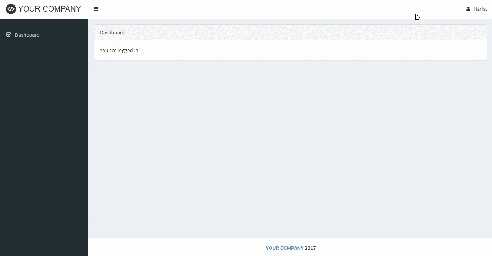
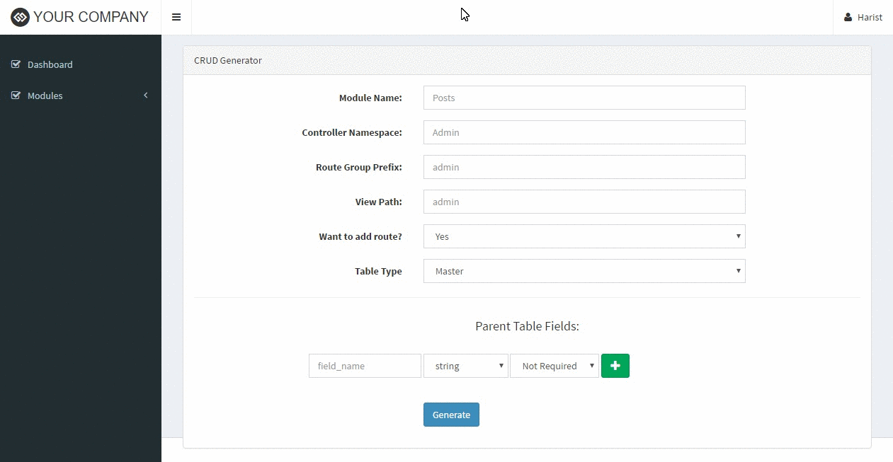

##cyom is abbreviation of create your own module

a crud generator module for laravel

###Installation

install laravel 5.2 project first

```
composer create-project --prefer-dist laravel/laravel "your_project_name" "5.2.*"
```

then add repository package from github to your project `composer.json`

```
{
    ...

    "repositories": [
        { "type" : "git", "url" : "git@github.com:abrachist/cyom.git" }
    ],

    "require": {

        ...,

        "abrachist/cyom": "1.0"
    },

    ...
}
```

update vendor packages using `composer update`

then add class provider to your project `config/app.php`

```
'providers' => [
    ...

    Abrachist\Webadmin\CyomServiceProvider::class,
    Collective\Html\HtmlServiceProvider::class,
],
```

and add alias of laravel collective html to your project `config/app.php` too

```
'aliases' => [
    ...

    'Form' => Collective\Html\FormFacade::class,
    'HTML' => Collective\Html\HtmlFacade::class,
],
```

run `composer dumpautoload` to reload registered autoload file

and the last thing install cyom package

```
php artisan cyom:install
```

if there is an error/problem about data seeder after installation, do this step to resolve the problem

```
composer dumpautoload

php artisan db:seed --class="ModuleSeeder"
```

Enjoy !!!

```




```


